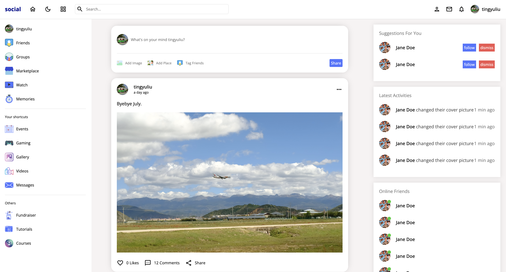
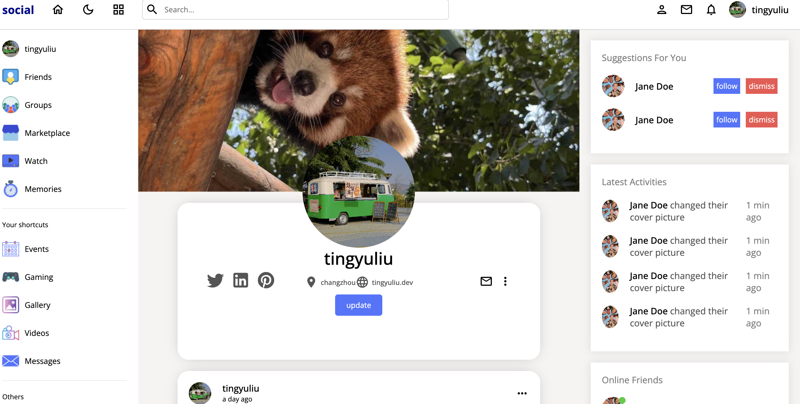

# Social-App README

This is a social application that includes features like login, register, posting, deleting posts, adding comments, liking, following, unfollowing, and editing profiles.

## Features

- **User Authentication:** Secure login and registration using JWT.
- **Post Management:**
  - Create posts
  - Delete posts
- **Social Interactions:**
  - Thumb up posts
  - Like posts
  - Follow users
  - Unfollow users
- **Profile Management:**
  - Edit your profile information

## Tech Stack

### Client-Side

- **React:** For building user interfaces.
- **SCSS:** For styling.
- **React Router:** For navigating through the app.
- **React Query:** For data fetching and state management.
- **axios:** For making HTTP requests.

### Server-Side

- **Node.js (Express.js):** For the backend.
- **MySQL:** For the database.
- **JWT (JSON Web Token):** For secure authentication.
- **bcryptjs:** For hashing passwords.
- **multer:** For handling file uploads.

## Screenshots

### Login page

### Home page

### Profile page

